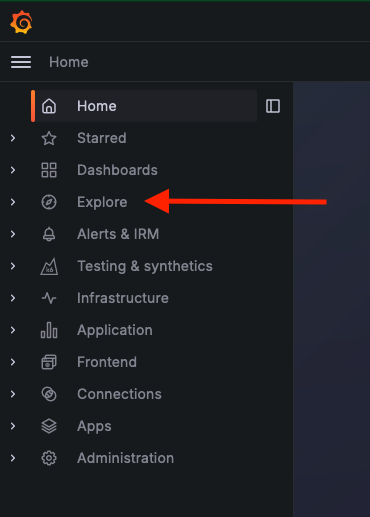
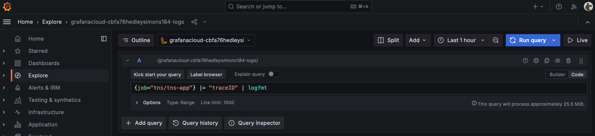
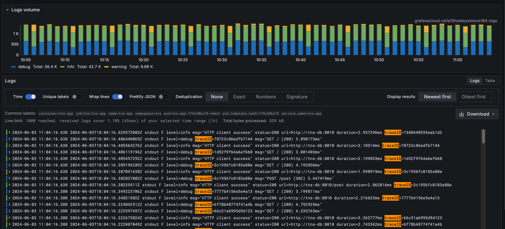
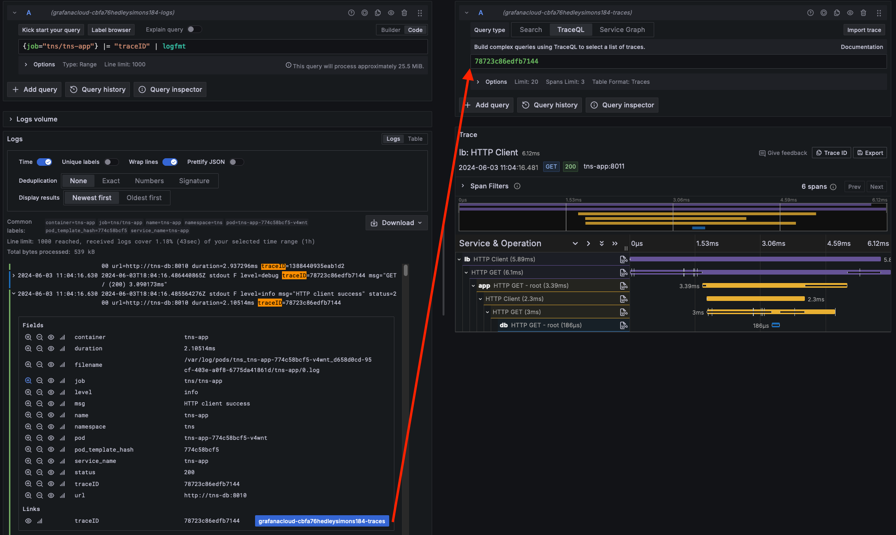
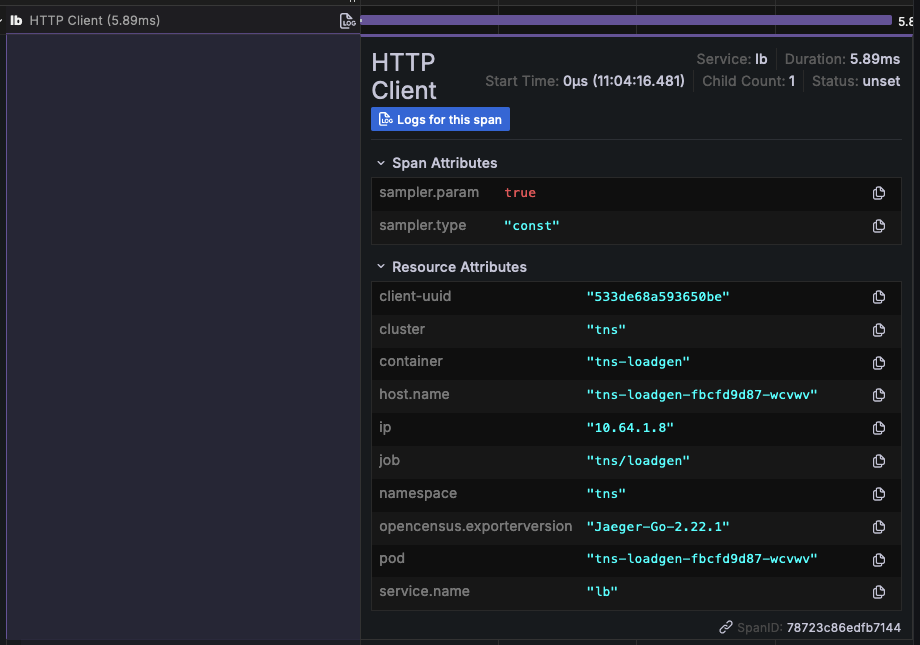
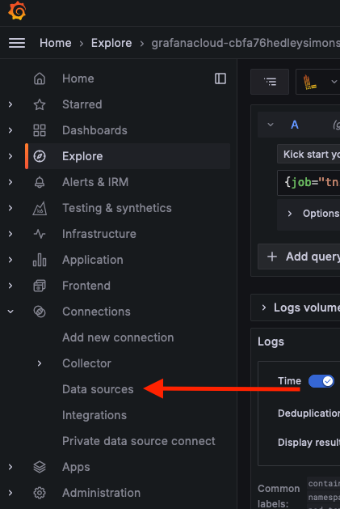
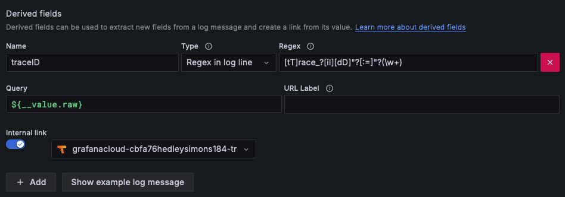
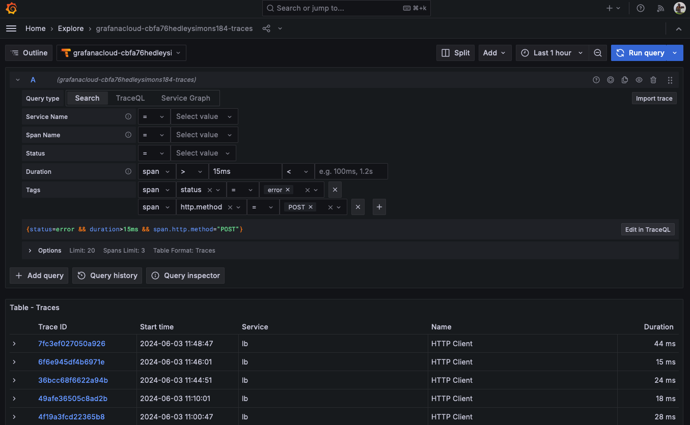
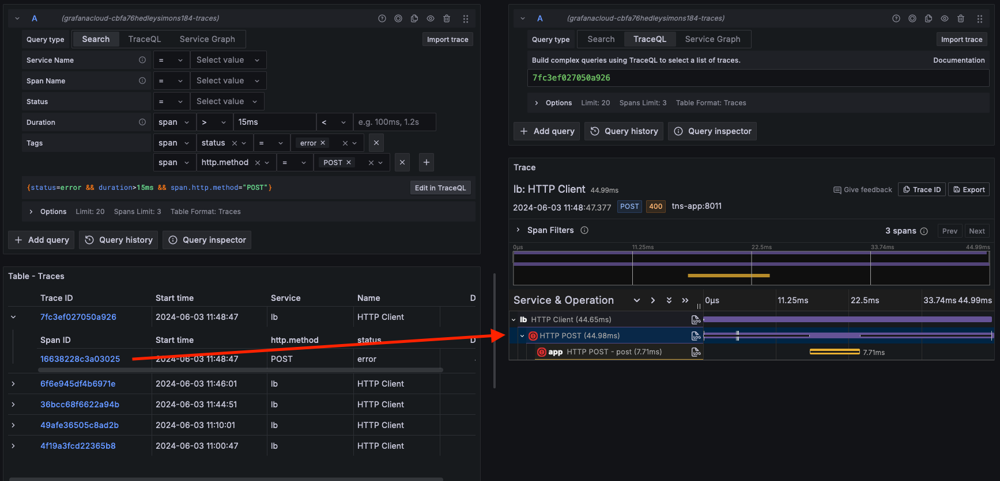
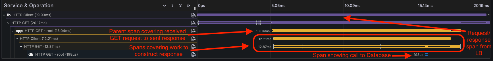

# Breakout 1 - Working With Traces in Grafana

## Pre-requisites

* Linux shell knowledge
* vim or Nano/Pico editor knowledge
* Access to the WebShell via the link you received in your workshop email
  * Note: Username and password should have been pre-supplied

This workshop includes the editing of files in the WebTerminal you have been given login details for. Both vim and pico have been included in the webterminal to allow you to carry out this editing. All of the examples in this breakout use `pico`, as it’s a simple to use editor, but feel free to use `vim` if you’re familiar with it.

The Pico editor can be navigated using your keyboard cursor keys (as well as Page-Up and Page-Down to move pages), as well as some specific `Ctrl` key based shortcuts:

* Paste: **Ctrl-V**
* Save file: **Ctrl-O**
* Quit: **Ctrl-X**
* Cancel: **Ctrl-C**

## Breakout

In this breakout, you’re going to examine some traces being ingested into Grafana Cloud Traces, and learn how to find them and observe them.

We’ll be looking at the log and trace output from a small demonstration application maintained by Grafana Labs called The New Stack (or the TNS app). This is a simple microservice application consisting of a load balancer application that makes requests to an API microservice exposing several HTTP endpoints, which itself requests data from a third microservice hosting a database. The load balancer includes an automated tester which continually makes calls to the API.

1. Log into your Grafana instance by going to the Grafana website using URL, login and password credentials you were sent.

2. You should see the welcome page. Go to the Explore menu by selecting the icon from the left-hand menubar:

   

3. Select the Logs data source that you see (it’ll be named something like `grafanacloud-someorg-logs`):

4. First change from the query builder to the the LogQL parser. Do this by selecting `Code` from the right-hand  side of the panel. Now use the log explorer to select all of the logs for the `tns/tns-app` job. You can do this either from `Label browser` dialogue and selecting the **requester** job, or by simply entering the following into the LogQL query line (`Enter a Loki query` edit field):

   ```
   {job="tns/tns-app"} |= "traceID" | logfmt
   ```

   

   Note that in this LogQL query, we request all the logs from the TNS job using the `tns/tns-app` label, and then filter these to only return log lines that include a trace ID. We’re doing this because the TNS includes log lines that report errors, and these won’t include a trace ID we can use (this is not to say we can’t log traceIDs with errors in them, but in this case none of those lines include a trace ID).

5. Now run the query (**Shift-Enter**, the **Run query** button or the **Show Logs** button). You’ll see a lot of logs that look like this:



6. Select one of these log lines, and it’ll expand into a detailed view for that log along with all the detected fields found, including the trace ID. We could copy and paste the trace ID into a new Tempo Explorer panel to see the trace, but if we wanted to look at a few different traces, this would quickly become a chore. However, you’ll note that there’s actually a blue pill button next to the `traceID` derived field. This is a link directly to the trace specified by the ID. Click on the button and it’ll take you straight to the relevant trace:

   

   We can see several spans in this trace, which are related to making a request to the downstream API server, as well as that server making calls to the database. Much in the same way that you can see details on a particular log entry using the log panel, you can dig into the contents of a span by selecting that span in the tracing diagram. Close the left-hand panel by selecting **Close**. This will expand the right hand tracing panel to the full width of your browser. Now select the name of the first span in the trace (most probably `lb HTTP Client`), and then expand the `Span Attributes` and `Resource Attributes` sections:

   

   This span has a process attribute called `service.name` which identifies the process the span was generated by (`lb` for load balancer), and a few custom span attributes. The resource attributes have been added by the instrumentation library.

   Once you’ve looked around the spans, let’s quickly look at how we could jump from the logs to the trace with the blue pill button. As part of the initialisation step in Grafana Cloud, the Grafana Cloud Logs are searched for the `traceID=<id>` string, and if this exists in a log line then Grafana makes an implicit link to the Grafana Cloud Tracing data source to search for that trace ID.

7. To see how this is configured, go to the Data Source page by selecting the **Configuration** icon in the left-hand menu bar and selecting **Data sources**:

   

8. Now select the Loki data source (it’ll be called something like `grafanacloud-someorg-logs` and to the left will be a Loki icon ().

   At the bottom of the Grafana Cloud Logs data source, you’ll see a `Derived Fields` section that looks like this:

   

   This section defined the `traceID` derived field, looking for a regular expression in each log line (`traceID=(\w+)`) and should it find a match, uses the captured value as the trace ID to send to the `grafanacloud-someorg-traces` data source (via an internal link). The result is the blue pill button we used to get straight to the trace from the log. You can add as many different derived sources as required.

9. Going back to the Explore page, let's find some traces by using some span attribute characterists that interest us. Select the Tempo data source, which will be named something like `grafanacloud-myorganisation-traces` and then ensure that you select the `Search` tab. You’ll see a number of fields and dropdown menus. If we wanted to, we could enter a trace ID directly into the `TraceQL` edit field to search for a specific trace via its ID (for example if we already had a specific trace ID of interest), however for now we'll specify some search terms instead to get a list of traces that match patterns we'd like to see.


   In the `Duration` field, ensure that the span duration is over 15ms. In the `Tags` section, set the `Select tag` field to `status` the comparator to `=` and the value to `error`. Create a new tag filter using the `+` to the right side of the line you just filled in, and in the new line set the `Select tag` field to `http.method`, the comparator to `=` and the value to `POST`. Now either select ***Run query*** in the top right of the Explore window, or hit ***Shift-Enter***.

   You should now see something like the following screenshot:

   

   As you can see, the results are returned in a table format, with the trace ID as the second column, allowing you to easily select relevant traces. You could select a trace ID to open it to the right in a new panel, but if you expand the trace result you'll see the span that matched the criteria we set. By selecting this span, it will open the trace in a new panel to the right, but also jump to and highlight the matching span in the trace:

   

   Before we finish looking at searching, note that at the bottom of the `Search` panel, there's a line that looks like this:

   ```
   {status=error && duration>15ms && span.http.method="POST"}
   ```

   This is the TraceQL query that is being used to carry out the search via the criteria in the dropdown menus. We'll carry out a few TraceQL queries in the next breakout.

10. Close the trace visualisation panel (the right-hand panel) and go back to the left-side Tempo search panel. Remove the `15ms` value for the duration (to clear it), and then change the value for the `status` attribute to `unset` and the value for the `http.method` attribute to `GET`. Re-run the search query again via ***Run query*** or ***Shift-Enter***. Select one of the matching traces to open it to the right-hand side, and then close the left-hand search panel. Now let’s dig into what we know about traces and spans to examine this trace.

   

   The root (first) span, denoted by `Request/response span from LB` is the request/response span, showing an initial request of data to the microservice architecture. This would look similar to any application that exposes endpoints that can be used by an API that exists, for example, as a public Internet service. The length of this span is from the time a request was made to when a response was received.

   The `Parent span covering received GET request to sent response` is the span that shows the time taken between the API service receiving the load balancer’s request, and it sending back a response (similar to the parent span in the load balancer).

   This span has several children, grouped together in the `Spans covering work to construct response`, that show the work carried out to actually create a response, including the middleware layers that parse the response, as well as the query to the Postgres database to GET data from it. This culminates in the `Span showing call to Database`, where the database service itself is called and retrieves data.

   You’ll notice that there’s a span in the load balancer that’s actually longer than the traces' originating parent span. This is because this is the span covering the HTTP call to the API endpoint, and this includes the creation of a socket to that service, the return of data and then the cleanup of that socket before it finishes. This process takes longer than the return of the response to the parent span, and so finishes after it. Hence, when this span finishes, as it’s the final piece of work carried out, so does the span.

   Note that through the trace, each span shows a black line in the vertical center of it when that span is on the critical path. This means that the span was, at that point, the span carrying out work required to deliver a response to the requester. This is important, because there could be many spans in trace which continue after their portion of the critical path (for example, when freeing resources or calling cleanup code). Evalutating the critical path in a trace shows you the potential portions of a span where optimisation may help lower latency durations, for example.


In this breakout, you’ve learnt how to work with traces and logs denoting trace IDs, as well as how to correlate between the two, and examined how to interpret and dig into traces.

And that's the end of the first breakout!
