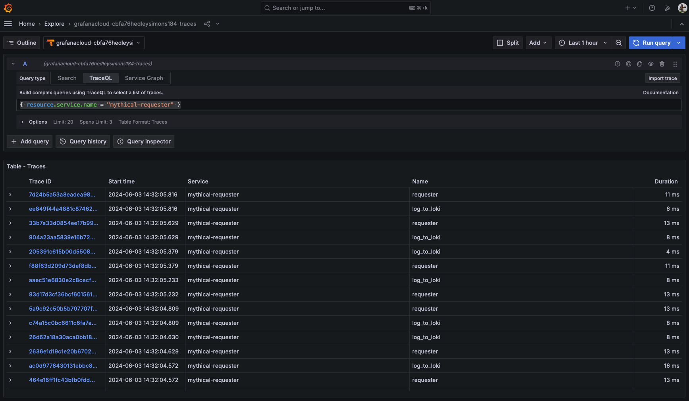
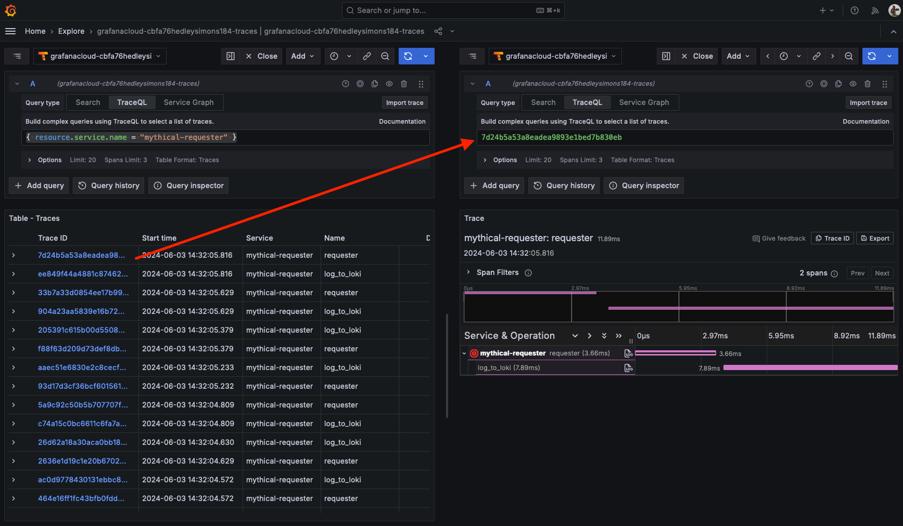

# Breakout 2 - Instrumenting Code for Traces

## Pre-requisites

* Linux shell knowledge
* vim or Nano/Pico editor knowledge
* Access to the WebShell via the link you received in your workshop email
  * Note: Username and password should have been pre-supplied

This workshop includes the editing of files in the WebTerminal you have been given login details for. Both vim and pico have been included in the webterminal to allow you to carry out this editing. All of the examples in this breakout use `pico`, as it’s a simple to use editor, but feel free to use `vim` if you’re familiar with it.

The Pico editor can be navigated using your keyboard cursor keys (as well as Page-Up and Page-Down to move pages), as well as some specific `Ctrl` key based shortcuts:

* Paste: **Ctrl-V**
* Save file: **Ctrl-O**
* Quit: **Ctrl-X**
* Cancel: **Ctrl-C**

## Breakout

In this breakout, you’re going to instrument a small piece of JavaScript code to send traces to Grafana Cloud and then examine those traces.

---
:bangbang: Important Note: :bangbang:

This breakout relies on the correct modification of code. As with everything in life, nothing is guaranteed, and because of this there are finished copies of these files within your home directory in the web shell. Should you fail to see traces and logs in Grafana after making the code changes, run the following to rebuild the application with working code and deploy it:

:sos:
```bash
./golden-source-build.sh
```
---

1. Start by logging into the webterminal with your username and password. This will log you into a home directory in a Debian Linux shell where we’ll edit some files and deploy an application to a k8s cluster.

    Your home directory includes a few things:

   * Manifests for deploying both applications and a Grafana Agent instance to a k8s cluster, as well as shell scripts to automate this for you.
   * Source code for a small application that consists of a HTTP server that talks to a Postgres Database, as well as a service that makes HTTP `GET`/`POST`/`DELETE` requests to the HTTP server.

   As mentioned in the workshop presentation, there are a couple of ways to instrument your source code to start receiving traces from them. The first is that of manually instrumenting code, where a developer decides what they want to trace, and which code to create spans for.

   We’re going to first modify the requesting service so we can get some traces out of it, and see them in Grafana Cloud.

2. Run:
   ```bash
   pico source/requester/index.js
   ```

   in the shell.

   In this source file you’ll see some code that:

   * Includes (`require`s in NodeJS parlance) some utility libraries (the first three lines) including a logging library that sends messages to Grafana Cloud Logging via the Grafana Agent.
   * Defines the names of some mythical beasts.
   * Defines a `makeRequest` function that makes requests to the downstream HTTP server.

   This `makeRequest` function is called on a set of timers that reset themselves when it completes. We’re going to add tracing to this function.

3. At the very top of the source file, add:

   ```javascript
   const tracingUtils = require('./tracing')();
   const { api, tracer, propagator } = tracingUtils;
   ```

   To import the tracing libraries and then assign the objects we need to use tracing to some local variables. The `tracing` file is a small utility file that we’ve written that includes all of the OpenTelemetry libraries that are required, and exposes some objects we can use to add traces and spans.

4. Move to the `makeRequest` function definition. You can see some variables declared at the start of this function. We’re going to create a new span after these variable definitions which will include all of the code in the function.

   After the `let error = false;` line, add a newline with ‘Enter’, and then add:
   ```javascript
       // Create a new span
       const requestSpan = tracer.startSpan("requester");
       requestSpan.setAttribute('creature.type', beast);
       const { traceId } = requestSpan.spanContext();
   ```

   This will do a few things, in order of line:

   * Create a new span. As this is the first span we’ve declared, it’ll be the first span in a new trace.
   * Sets a new span attribute on the span, the `creature.type` attribute, whose value will be the current value of the `beast` variable.
   * Retrieve the trace ID of the span (the trace the span belongs to). As this is a new trace, a new trace ID will have been created with the span we're generating as the root span.

5. Now that we have a new span, we need to create a context for it. The context will wrap the entirety of the rest of the function, letting the instrumentation library know that any code executed in it belongs to the `requester` span. Below the code you’ve just added, add the following:

   ```javascript
       // Create a new context for this request
       api.context.with(api.trace.setSpan(api.context.active(), requestSpan), async () => {
   ```

6. Under the lines you just added, copy and paste the following line:

   ```javascript
           // Add the headers required for trace propagation
           headers = propagator(requestSpan);
   ```

   Remember that in the workshop, we've learnt that to ensure that the trace can continue between services, we need to ***propagate*** the trace information from any service that makes a call to a downstream service. As we’ll want to continue the trace in the server, we use the propagation function defined in the tracing utilities to do this. The `propagator` function adds a new HTTP header to the headers we’ll send, containing the trace information (the trace ID and the current span ID) which the OpenTelemetry tracing collector in the downstream service will unpack to generate child spans of the passed span ID, continuing spans in the same trace.

7. Now use the cursor down arrow or page down on your keyboard until you see the following (it is close to the bottom of the source file):

   ```javascript
       // Sometime in the next two seconds, but larger than 100ms
       const nextReqIn = (Math.random() * 1000) + 100;
   ```

   This code isn’t part of what we want to instrument, so on the **line before this code starts**, copy and paste the following into the editor:

   ```javascript
           // Set the status code as OK and end the span
           requestSpan.setStatus({ code: (!error) ? api.SpanStatusCode.OK : api.SpanStatusCode.ERROR });
           requestSpan.end();
       });
   ```

   This sets the error code for the span after the downstream server has either returned successfully or thrown an error. It then ends the span we created. Note that whilst this ends the span we created, it doesn’t necessarily end the trace, as there may be further operations occurring that also had a span associated with it.

8. Finally, save the code you’ve just added (in Pico by typing **Ctrl-O**) and then quit the editor (again, in Pico with **Ctrl-X**.) If you don’t save, you’ll be first asked if you want to save the file if you just hit **Ctrl-X**.

   Congratulations, you’ve just manually instrumented some code! That wasn’t so hard!

9. Next, deploy the Grafana Agent:
   ```bash
   ./configure-agent-and-deploy.sh
   ```

   This will allow our logs, metrics and traces to be sent to Grafana Cloud via Grafana Alloy.

   **Note:** You may see an error like `Error from server (NotFound): error when deleting` on several lines when you run this for the first time. Don't worry about this, it's just because the agent isn't already running on the cluster.

10. Finally, we’re going to build and deploy the application we just changed using a small script. At the Webterminal prompt, run:
    ```bash
    ./build-application-and-deploy.sh
    ```

    Again, don’t worry about any deletion errors on you might see, this is expected on a first run.

    This will build a couple of new Docker images, upload it to the workshop registry and then deploy the application to Kubernetes using the new image.

11. Let’s take a look at the resulting output in Grafana. Log into your Grafana instance by going to the Grafana website and using the URL, login and password credentials you were sent. The application you’ve just deployed is sending log and tracing data to that Grafana Cloud instance.

     Very quickly, we’re going to test that we’re seeing logs and can use them to access traces referenced by trace ID.

12. In the Explore page, select the Tempo data source (it'll be named something like `grafanacloud-someorg-traces`).

13. Ensure that the `TraceQL` query type is selected, and then enter the following into the query editor:
    ```
    { resource.service.name = "mythical-requester" }
    ```
    We're using TraceQL to find traces from the service we've just instrumented. If you remember some of the basics of TraceQL, this query will find any span whose `service.name` resource attribute is set to `mythical-requester`. Now run the query (either with ***Shift-Enter**,the **Run query** button or the **Show Logs** button). You should see several returned traces:

    

14. Select one of the traces in the returned list, to open the trace in a right-hand panel:

    

15. Select the first span in the trace (`requester`), and expand the `Span Attributes` and `Resource Attributes` sections:

    

    This span has a single resource attribute (`service.name`) which identifies the process the span was generated by (`mythical-requester`), and quite a few custom span attributes. If you remember from the code, when we generated the top-level span for the requester, we added a `creature.type` span which denoted the type of creature that was being requested. This is the first span attribute seen here. We could have added as many attributess as we wanted. The other attributes have been added by the OpenTelemetry instrumentation library.

    However, the traces we're seeing are completely self-contained within a single process. This is because we’ve only instrumented one of the two microservices that make up the entire service. Part of what we want to do is see the entire distributed trace for the service.

16. Go back to the WebTerminal login you have (and keep the tab with Grafana open, we’ll come back to this). We’re going to add some auto-instrumentation to the downstream server, which will continue the trace we started in the requester.

    Open the server code:
    ```bash
    pico source/server/index.js
    ```

    

    This source file, as you might expect, is quite a bit longer than the requester code, as it’s a web server that:

    * Accepts REST `GET`/`POST`/`DELETE` calls.
    * Stores and retrieves data from the Postgres Database.
    * Outputs metrics based on requests made.
    * Defines several API endpoint functions.

    It’s about 300 lines of code (so actually pretty small as far as servers go), but still contains a lot that needs instrumenting to be useful. There’s an awful lot going on under the hood that we need to be able to gather data for, with quite a few spans in detail for a trace to be truly useful.

    OK, take a deep breath first to get ready! Right, let’s instrument it!

17. At the very top of the source file, add the following line so it’s the first line in the file:

    ```javascript
    require('./tracing')();
    ```

18. Save the file (in Pico with **Ctrl-O**) and then exit the editor (in Pico with **Ctrl-X**).

    You’re done!

    The entire server code, including all imported files, has now been instrumented using OpenTelemetry’s default instrumentations for popular middlewares. Essentially by including it as the very first line, all following imported code can be injected with hooks that generate spans when this code is called.

    In fact, this could have been even simpler, as NodeJS includes the ability to pass arguments to the binary, and this allows us to simply pass the OpenTelemetry tracing libraries as arguments with environment variables. But because we're also manually instrumenting a service, we're using the same shim library to auto-instrument the server.

19. Redeploy the entire application with the following command:
    ```bash
    ./build-application-and-deploy.sh
    ```

    Wait for the code to be rebuilt and deployed to the underlying cluster.

20. Once redeployed, go back to the Grafana tab you had open in your browser. As both services are now instrumented (`mythical-requester` and the `mythical-server` service), we're giong to use a TraceQL query that takes advantage of that to find some very specific traces. Go back to the Explorer and enter the following TraceQL query into the query editor:

    ```
    { span.db.statement =~ "^INSERT.*?manticore.*" && status = error } << { resource.service.name = "mythical-requester" } | select(span.creature.type)
    ```

    This query is a bit more detailed (to say the least!) from the last TraceQL query we performed, so before we execute it, let's break it down a little:

    ```
    { span.db.statement =~ "^INSERT.*?manticore.*" && status = error }
    ```
    * Find spans that have a `db.statement` span attribute.
    * The value of the `db.statement` attribute matches a regular expression, in this case that starts with `INSERT` and includes the text `manticore` somewhere in the string.
    * The span has a status value of `error`.

    ```
    { span.db.statement =~ "^INSERT.*?manticore.*" && status = error } << { resource.service.name = "mythical-requester" }
    ```
    * Match the previous spans only if one of its ancestors is a span including the resource attribute `service.name` that has a value of `mythical-requester`. ie. that the span is occurs in downstream span from any span in `mythical-requester`.

    ```
    | select(span.creature.type)
    ```
    * For the returned spanset, select the `creature.type` span attribute as part of the query results, which will show the value in the span columns as well as the other selected values (the status and the service name).

    Now knowing what we're searching for, run the query with ***Run query*** or ***Shift-Enter***. You'll see a list of results that match the TraceQL query. Expand one of the returned results so you can see the matching span selector fields:

    

    We see that the selected `creature.type` is `manticore` (which we would expect, given the value of `db.statement`!).

21. Select one of the traces in the returned results, you'll see a trace like the following:

    

    If you look closely at the trace you’ll see that there are now spans from two separate services, each denoted in different colours.

    In the above screenshot, the spans generated from the requester are in pink, whilst the spans generated from the server are in purple. All of a sudden we can see an awful lot more in the trace, which is a huge shift in the amount of detail we can dig into to see where latencies occur.

    OpenTelemetry’s auto-instrumentation has found a lot of common middleware in the server, and then applied spans to entry points within these middlewares to generate spans that would be of interest to any developer that has to maintain and optimise the code. In short, it’s saved an awful lot of manual instrumentation effort that we might have had to carry out.

    Obviously, in a production service environment, there would be a lot of proprietary code that would also need instrumenting, but it’s easy to augment auto-instrumentation with manual instrumentation in much the same way we manually instrumented the requester.

22. Remove the left-hand panel (the Tempo TraceQL panel), by selecting `Close` to expand the trace diagram panel. Let’s have a quick look at the spans in the trace.

    There are two services in the trace, the `mythical-requester` which makes requests to the server, and the `mythical-creatures` which receives these requests and then sends a response.

    For most traces, the length of the top-level `mythical-requester` span is actually shorter than the total trace, and several spans that continue to occur before the trace finishes.

    You can see the critical path of the trace as the black bar that runs centrally through those spans as they carry out the critical work as part of the trace.

23. This trace is interesting, because it shows an example of a trace where errors occurred (the exclamation mark in the red circle). We can see that the error propagates up from the span hierarchy from where it was actually thrown (and then ancestor spans also have an error set because the underlying error caused them to flag that a problem occurred).

    Open up the lowest span in the hierarchy with the error set (it will be the span named `pg.query:INSERT`) and expand its `Span Attributes` block. It will look similar to this:

    

    All of these spans have been auto-instrumented, and the library that makes a downstream call to the Postgres database, `pg`, has been instrumented by its authors. As such, it includes a large amount of contextual span attribute information to tell us what it's doing. We can see the connection string, the database name, the user, etc., but the interesting thing here is the `db.statement` attribute (which we used to find this trace in the first place).

    This shows us that it was trying to carry out the following Postgres statement:
    ```
    INSERT INTO manticore(name) VALUES ($1)
    ```
    That in itself is fairly normal, there's a table called `manticore` and the call was to insert new data into it. However, this is a failing query. If you look at the top line of the span, including the `Service`, `Duration` and `Kind` intrinsics, you'll also se the `Status` and `Status message` fields. The `Status` is of `error` (again, how we found the trace), and the `Status message` is:

    ```
    null value in column "name" of relation "manticore" violates not-null constraint
    ```

    If you know a bit about SQL databases, you'll immediately know that the code tried to set a value of `null` into a new row in the `manticore` table, where the Postgres database had been told a `null` value was illegal. As such, Postgres threw an error and we now know the reason for it. We could now go and fix the code to ensure we don't try and do this again, and shows the power of adding tracing as a signal to your applications!

And that's the end of this breakout!
